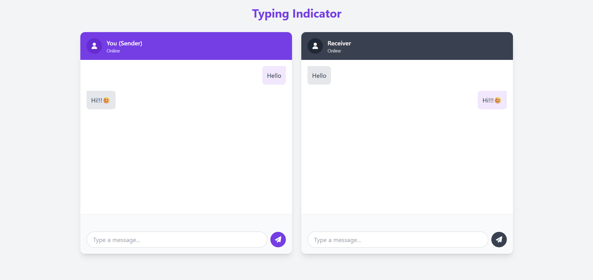

# WhatsApp-like Chat Interface

A responsive, dual-panel chat interface with real-time typing indicators, inspired by WhatsApp. Built with HTML, Tailwind CSS, and vanilla JavaScript.



## Features

- 💬 **Dual-panel interface** - See both sender and receiver views simultaneously
- ✍️ **Real-time typing indicators** - Visual feedback when the other party is typing
- 🔄 **Synced messaging** - Messages appear instantly on both panels
- � **Modern UI** - Clean, responsive design with purple color scheme
- ⚡ **No backend required** - Pure frontend implementation

## Technologies Used

- HTML5
- Tailwind CSS (v3.x)
- Vanilla JavaScript
- Font Awesome (v6) for icons

## Installation & Usage

1. Clone the repository:
   ```bash
   git clone https://github.com/Scylox56/Whatsapp-Like-Website.git
`
2. Open index.html in your browser - no server required!

3. Use the interface:
- Type in either panel to see the typing indicator appear in the other panel
- Press Enter or click the send button to post messages
- Messages will appear on both panels with correct alignment

## Customization
You can easily customize:

- Colors: Modify the purple shades in the Tailwind config
- Height: Adjust the chat container height in the CSS
- Animations: Tweak the typing indicator animation timing

## How It Works
The implementation uses:

- Typing detection via keyboard events
- Timeouts to hide indicators after inactivity
- DOM manipulation to sync messages between panels
- Tailwind's utility classes for styling

## License
MIT License - see LICENSE file
